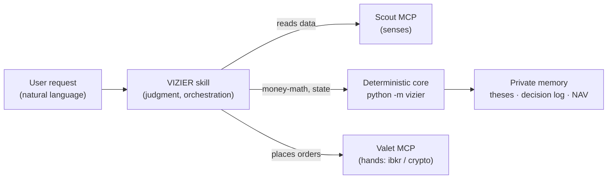
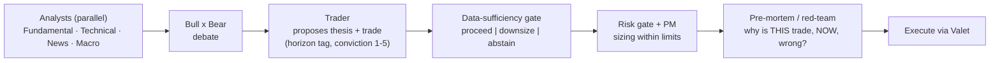

<p align="center">
  <strong>Vizier</strong> — the decision-making brain of an agentic-trading stack.
</p>

<p align="center">
  <em>Scout senses · Valet acts · <strong>Vizier decides.</strong></em><br>
  A <strong>Claude Code skill</strong> that researches, decides, remembers and orchestrates trades across
  US stocks/ETFs (Interactive Brokers) and crypto spot (CCXT) — by driving two MCP servers it never modifies.
</p>

<p align="center">
  
  
  
  
</p>

> **Not financial advice.** Vizier is a research-and-orchestration tool, not a guarantee of returns. It is
> **paper-first / shadow-mode by default**: out of the box it journals decisions or trades against a paper
> account / exchange testnet. **Real-money autonomy is the last rung of a deliberate ladder** (shadow →
> paper → live read-only → real money), gated behind a forward-test and a live read-only validation. Use at
> your own risk.

## What this is

**Vizier** is the **brain** of a three-part split — a single, natural-language-driven Claude Code skill
(`/vizier`) that turns a request like *"research the market and make 3 investments totaling $100"* into
researched, risk-checked, journaled trades. It is the one component that touches both MCP servers:

- **Brain** — **Vizier** (this repo): decides *what/when*, sizes by conviction, remembers theses between
  sessions, enforces the money-safety rules, and produces the human-readable call.
- **Senses** — [Scout](https://github.com/pedrobraiti/mcp-market-research): gathers & structures market data
  (stateless, data-not-verdict, keyless).
- **Hands** — [Valet](https://github.com/pedrobraiti/agentic-trading-mcp): executes orders on Interactive
  Brokers (stocks/ETFs) and crypto exchanges (spot, via CCXT).

| Layer | Project | Role |
|---|---|---|
| **Senses** | [Scout](https://github.com/pedrobraiti/mcp-market-research) | Gathers & structures market data — stateless, data-not-verdict, keyless (53 tools). |
| **Hands** | [Valet](https://github.com/pedrobraiti/agentic-trading-mcp) | Executes orders on IBKR (stocks/ETFs, 19 tools) and crypto exchanges (spot, CCXT, 14 tools). |
| **Brain** | **Vizier** (this repo) | Researches, decides, remembers, orchestrates. The only thing that touches both MCPs. |

> **The inviolable boundary.** The MCPs are deliberately dumb (I/O without judgment). Vizier **consumes**
> them exactly as they are and **never** modifies, adds to, or plugs logic into them. All intelligence,
> glue, state and decision lives in the skill. No MCP calls another; no MCP concludes.

## What Vizier is (and isn't)

- **One skill, natural-language-driven** — there is no `/analyze` vs `/invest`. Behavior is read from intent:
  an empty/vague call → a read-only market sweep; *"research MU"* → a thesis, no execution; *"buy $3 of
  AAPL"* → an order it just executes. It pauses to ask **only on real ambiguity** ("invest a little"), never
  double-confirms the obvious, and treats *"I think I should sell"* as deliberation, not an order.
- **Multi-horizon** — every analysis yields a **long-term** read (quality/fundamentals) *and* a
  **short-term** read (technicals/catalyst/flow), and presents both; divergence is a feature. Each
  thesis/position carries a `core` vs `tactical` tag so anti-churn applies correctly per horizon.
- **Multi-venue** — US equities/ETFs (the `ibkr` server) and crypto spot (the `crypto` server), routed by
  the asset; risk limits and NAV are kept strictly per-account / per-venue.
- **Manager / breadth discovery** — a broad request (*"analyze the market and bring me recommendations"*)
  makes Vizier the **manager of a research team**: it partitions the market into coverage areas, fans out
  **research-only** envoy subagents across them in parallel, then prunes the funnel by potential, risk/reward
  and **correlation-based diversification** — so the shortlist spans the market instead of three of the same
  bet. The envoys can only read (Scout); only the main thread ever executes. Note the cost split: a plain
  *"what's going on in the market?"* is the **cheap, fixed, read-only** sweep, while *"bring me
  recommendations"* triggers the **expensive multi-agent fan-out** (N parallel envoys) — Vizier never
  auto-escalates the cheap call into the expensive one. Breadth defaults to a **US equities/ETFs + crypto
  spot** universe (risk kept per venue).
- **Confirmation by default; autonomy strictly opt-in** — a complete, explicit order (asset + amount,
  e.g. *"buy $50 of AAPL"*) is itself the confirmation: it executes after the safety gates without an
  extra prompt. "Confirmation by default" is what governs **under-specified or skill-derived** trades
  ("invest a little", a thesis Vizier proposed) — there it shows its reasoning and waits for your OK
  before any live order. Autonomy is a separate, conscious choice with hard, code-enforced prerequisites.

## How it thinks

Vizier is a **hybrid**: the *judgment* lives in the skill (`SKILL.md` + `references/`, loaded on demand),
while every **money-sensitive calculation** lives in a deterministic Python core the skill calls and reads
back as a `{"ok": bool, "data": ...}` envelope. Code does the math that must not be re-derived by an LLM
"in its head" between rounds — that is exactly the forget-between-rounds failure the split prevents.



The reasoning runs as a fan-out of subagents, adapting depth to the request:



Research mode stops at *"Trader proposes"*; execution mode continues through the gates to Valet, then
journals the thesis and the fills.

## The safety model (code-enforced, fail-closed)

The money-safety rules are not prose the model is asked to remember — they are deterministic checks with
exact, self-latching arithmetic. A precise word on bindingness: these checks are **advisory/bookkeeping
that bind when the skill calls them** each candidate with an honest live NAV — Vizier holds no order pipe of
its own, so the one **hard, code-enforced dollar backstop is the Valet's `MAX_DAILY_VALUE`** (enforced at
the executor no matter what the skill does), which is why arming autonomy is forbidden until it is set. The
dangerous mode (autonomy) is guarded by four composed legs plus a re-arm guard — a backstop for the **robot
running unattended**, never a clamp on a human's confirmed explicit order:

- **Cumulative daily ceiling** — at most a configured % of the **fixed start-of-day NAV** (50% on the
  aggressive profile) can be deployed across a rolling 24h window, sourced from the persistent decision log
  so it survives restarts and `/loop`s. A shrinking account never re-authorizes fresh slices — this is the
  drain fix (a per-round cap alone does *not* stop a loop from emptying the account).
- **Per-run ceiling** — a single autonomous round is capped at a smaller % (33%) or a max trade count,
  anchored to the same fixed baseline; it resets each round.
- **Drawdown kill** — if NAV falls past a kill threshold from the day baseline, the gate **latches** the
  kill and hard-blocks every further candidate (even if NAV recovers); the skill then disarms and a
  deliberate manual re-arm is required. (The latch is code; the disarm action is the skill obeying the
  block — the gate does not auto-disarm for you.)
- **Re-arm guard** — `arm-autonomy` **refuses** while a window is still active (re-arming would reset the
  baseline and wipe the day's spend — a drain vector); a legitimate re-arm requires an explicit disarm or
  window expiry. No force-override.
- **Per-order discipline** — re-verify the session/`account_type` before every order, re-check the circuit
  breaker, reconcile against your **own** sent-order log ∪ broker positions (never lagged positions alone),
  and run a mandatory data-sufficiency gate that downsizes or abstains when the evidence isn't there — even
  under an explicit order.

The Valet's own per-order guards (`MAX_ORDER_VALUE`, `MAX_DAILY_VALUE`, `DUPLICATE_WINDOW_SECONDS`) are set
as an independent second line when arming. Live execution is venue-specific and gated; **real-money
autonomy is the last rung**:

```
shadow (journal / dry-run)  ->  paper / testnet  ->  live read-only  ->  real-money autonomy
```

## Install & use

### Full-stack setup (in order)

First time? The three repos have a dependency order — set them up in this sequence:

1. **Scout** (data MCP — keyless, fast): [`mcp-market-research`](https://github.com/pedrobraiti/mcp-market-research).
   Gives you research immediately, no accounts or keys.
2. **Valet** (execution MCP — the longest step): [`agentic-trading-mcp`](https://github.com/pedrobraiti/agentic-trading-mcp).
   For stocks it needs the Interactive Brokers Client Portal Gateway running plus a manual 2FA login;
   for crypto it needs exchange API keys. Skip this until you actually want to execute.
3. **Vizier** (this skill + its core): install per below, then **register BOTH MCP servers at user scope**
   (see *Register the MCP servers* below), and open a **new** Claude Code session so the skill and servers
   are picked up.

Two facts that decide what works without each piece: a read-only market sweep ("what's happening in the
market?") **requires the Scout MCP registered** — without it the skill has no data tools and degrades to
nothing useful; **execution requires the Valet MCP registered**. Research-only needs just Scout + Vizier.

### Installing this repo

Vizier has two pieces that both need to be in place: the **skill** (so `/vizier` is discoverable) and the
**deterministic core** (so the skill can call `python -m vizier ...`).

```bash
# 1. Clone
git clone https://github.com/pedrobraiti/vizier-trading-skill vizier && cd vizier

# 2. Install the deterministic core into the environment your agent uses.
#    The `vizier` package MUST be importable for `python -m vizier` to work.
python -m venv .venv
# Windows (PowerShell): & ".venv\Scripts\Activate.ps1"   (on a policy error: Set-ExecutionPolicy -Scope Process -ExecutionPolicy Bypass)
# Linux/macOS:          source .venv/bin/activate
pip install -e ".[dev]"

# 3. Make the skill discoverable by Claude Code at ~/.claude/skills/vizier
#    Windows (junction, no admin needed):
cmd /c mklink /J "%USERPROFILE%\.claude\skills\vizier" "%CD%"
#    Linux/macOS (symlink):
ln -s "$(pwd)" ~/.claude/skills/vizier
```

In a **new** Claude Code session the skill is available — invoke it in natural language (the trigger is the
intent, e.g. *"research NVDA"*, *"is my book healthy?"*, *"buy $50 of BTC"*, *"invest $100 across 3 ideas"*,
or the breadth sweep *"analyze the market and bring me recommendations"* / *"find the best opportunities"*).
For execution you also need the two MCP servers registered ([Scout](https://github.com/pedrobraiti/mcp-market-research),
[Valet](https://github.com/pedrobraiti/agentic-trading-mcp)); for research-only the skill degrades gracefully.

> To remove the deployed skill, delete the link: Windows `rmdir "%USERPROFILE%\.claude\skills\vizier"`
> (removing the junction, **not** its target); Linux/macOS `rm ~/.claude/skills/vizier`.

### Register the MCP servers (user scope)

The skill is global, so register Scout and Valet at **user scope** (`-s user`) — that makes them reachable
from `/vizier` in any directory. The default `claude mcp add` is *project*-scoped, which silently limits a
server to one folder (a common gotcha: the skill "works here but not there"). Point each command at the
venv python from that repo's own README:

```bash
# Scout (research) — one server
claude mcp add scout  -s user -- "/path/to/mcp-market-research/.venv/bin/python" -m scout.server.app
# Valet (execution) — two servers from the same repo
claude mcp add ibkr   -s user -- "/path/to/agentic-trading/.venv/bin/python"     -m ibkr_agent.server.app
claude mcp add crypto -s user -- "/path/to/agentic-trading/.venv/bin/python"     -m crypto_agent.server.app
```

Open a **new** Claude Code session afterward so the servers are picked up (`claude mcp list` to confirm).
Research-only needs just Scout; execution also needs Valet (with its IBKR gateway / exchange keys). On
Windows use the `.venv\Scripts\python.exe` path instead of `.venv/bin/python`.

### Hard research firewall (optional, recommended)

Breadth-discovery (manager mode) fans out **research-only** envoy subagents. By default that boundary is
held by dispatch discipline (the envoy is given only Scout tools). For a **hard** firewall — an envoy that
*cannot even see* the execution tools — install the bundled agent type so the envoys are spawned with the
Valet servers withheld:

```bash
# copy the agent type into your user agents dir (active next session)
mkdir -p ~/.claude/agents && cp agents/vizier-research-envoy.md ~/.claude/agents/
```

The agent's frontmatter is a default-deny `tools:` **allowlist** (`Read, Grep, Glob, mcp__scout`): the
envoy holds ONLY the Scout research server plus read tools and **can never see an execution tool** — no
Valet re-registration or new tool can leak in. If you registered Scout under a different server name,
substitute it there (see the maintainer note inside the file). Without this agent installed, the soft
dispatch boundary still applies and only the main thread ever executes.

### The deterministic core

Every money-sensitive helper is a subcommand; args go in `--json`, the result comes back as `{ok, data}`:

```bash
python -m vizier profile                                            # show the active risk profile
python -m vizier allocate --json '{"total_amount":100,"nav":10000,"explicit_order":true,"candidates":[{"ticker":"AAA","conviction":5},{"ticker":"BBB","conviction":3}]}'
python -m vizier autonomy-gate --json '{"candidate_value":200,"current_nav":990}'   # composed §B verdict
python -m vizier trim-qty --json '{"current_qty":2.0,"pct":30,"step":0.001}'        # %/$ -> sell qty, rounds down
```

Risk posture is **one editable file** — `config/risk_profile.yaml`: flip `active_profile`
(`conservative | moderate | aggressive`) or tweak a single number. Every limit is a percent of NAV, so it
works the same on a $100 account or a $100k one.

**Environment overrides.** Two optional env vars relocate the core's inputs without passing flags every
call: `VIZIER_PROFILE_PATH` (the risk-profile YAML, same as `--profile-path`) and `VIZIER_MEMORY_DIR`
(the private `memory/` dir, same as `--memory-dir`). Vizier holds no secrets, so there's nothing to put
in a `.env`.

## Memory & privacy model

Vizier remembers what the stateless Scout and point-in-time Valet cannot — *why* you bought, the entry date,
the horizon, the quantitative baseline to diff against. That state is **private**:

- **Code is public; real trading state is gitignored.** Theses (`memory/theses/*.yaml`), the decision log,
  NAV snapshots and autonomy state are written under `memory/` and never committed — only `EXAMPLE_*`
  templates and `.gitkeep` are. This mirrors how the MCPs gitignore their `.env`.
- The memory directory can be its own private git repo for versioned, off-GitHub history (`--commit`).

## Non-goals

- **No tax / wash-sale / withholding logic** — taxes are out of scope.
- **FX ignored** — the account is USD-funded; Vizier operates and reports P&L in USD.
- **Never modifies the MCPs** — anything neither MCP provides is solved in the skill, never by pushing logic
  into Scout or Valet.

## Development

```bash
pytest -q          # 117 offline tests (deterministic, no network, no real git)
ruff check .       # lint
```

The core is pure, deterministic functions (injectable clock and memory dir) so the money-safety guarantees
are tested in isolation — including the adversarial §B scenarios (loop drain, re-arm drain, drawdown kill,
double-buy lag, data-starvation).

## License

MIT — see [LICENSE](LICENSE).
